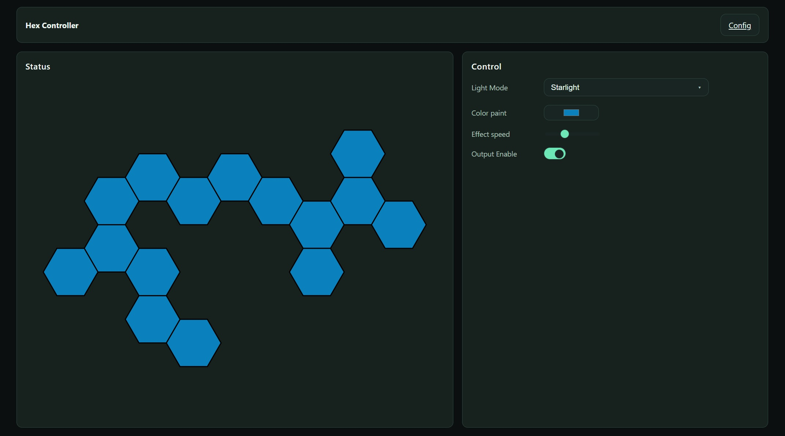
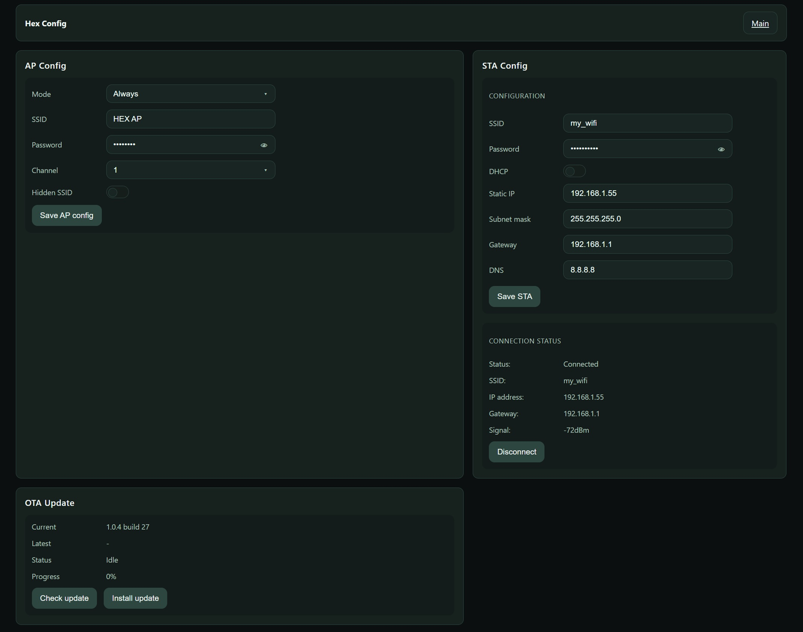

# ESP32 Hexagons LED Controller

An ESP32-based Wi-Fi LED controller for modular hexagonal lighting panels with a browser-based UI, persistent configuration storage and secure OTA firmware updates.

The project combines embedded firmware, a responsive web interface and a local IoT backend into a self-contained lighting controller that can be configured and updated directly over Wi-Fi.

---

## Project Overview

The system is built around a single ESP32 firmware application responsible for:

- driving the LED layout,
- hosting the web interface,
- handling network configuration,
- storing persistent settings in NVS,
- managing OTA firmware updates,
- communicating with a local update server.

The controller can operate entirely without a USB connection after initial flashing.

---

## User Interface

The controller exposes a browser-based interface available directly from the ESP32.

The main UI provides:

- visual preview of the hexagon LED layout,
- interactive color painting on individual hexagons,
- light mode selection,
- output enable control,
- effect speed adjustment,
- responsive layout for desktop and mobile devices.

## Configuration Interface

A separate configuration page provides access to maintenance and system settings.

Available configuration options include:

- Wi-Fi configuration,
- AP/STA mode management,
- DHCP/static IP selection,
- firmware version inspection,
- OTA update installation,
- OTA progress monitoring,
- system diagnostics.

---

## Main Features

### Networking

- STA + AP operating modes
- automatic AP fallback when STA connection fails
- configurable AP settings
- configurable STA settings
- DHCP and static IP support
- recovery button for forced AP mode
- persistent network configuration storage

### LED Control

- static color mode
- dynamic lighting effects
- adjustable effect speed
- per-hexagon painting
- browser-side LED preview
- synchronized firmware/UI state
- LED state persistence

### Reliability Features

- secure OTA firmware updates
- SHA-256 firmware verification
- firmware version checking
- staged OTA validation
- automatic rollback after failed update
- OTA status reporting to server backend
- deferred NVS writes to reduce flash wear
